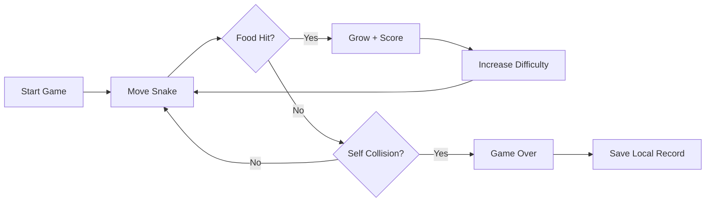
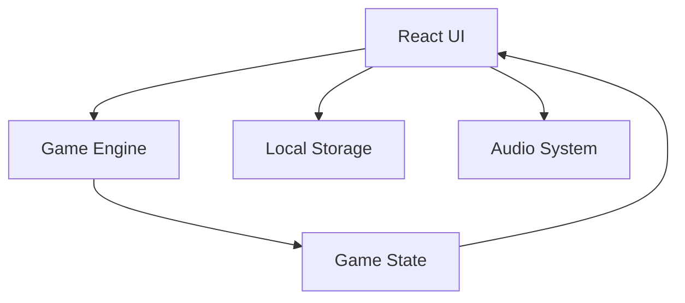

# OURO — Snake Game

[](https://snake-seven-zeta.vercel.app/)
[](https://react.dev/)
[](https://www.typescriptlang.org/)
[](https://vite.dev/)
[](LICENSE)

## Overview

OURO is a lightweight, responsive Snake game built with React and TypeScript. It combines classic snake mechanics with progressive speed, local records, themes, sound effects, customizable skins, fullscreen mode, and mobile controls.

**Live:** https://snake-seven-zeta.vercel.app/

## Features

- Classic Snake gameplay with wrap-around boundaries
- Self-collision game over
- Progressive speed increases
- Score, length, food, and survival tracking
- Local game records and preferences
- Light and dark themes
- Multiple snake and food skins
- Keyboard and touch controls
- Sound effects using Web Audio API
- Fullscreen mode
- Responsive desktop and mobile layout

## Game Flow



## Architecture



## Technology

- React
- TypeScript
- Vite
- Tailwind CSS
- Lucide React
- Motion
- Web Audio API
- Browser LocalStorage

## Run Locally

```bash
npm install
npm run dev
```

Open:

```text
http://localhost:3000
```

Production build:

```bash
npm run build
npm run preview
```

Type checking:

```bash
npm run lint
```

## Controls

| Action | Keyboard |
|---|---|
| Move | Arrow Keys / W A S D |
| Pause / Menu | P / Space |
| Restart | R |
| Fullscreen | F |
| Close Menu | Esc |

Mobile devices support touch/swipe controls.

## Data

Game statistics and preferences are stored locally in the browser using `localStorage`. No account or server-side player profile is required.

## License

Licensed under the Apache License 2.0. See [LICENSE](LICENSE).
